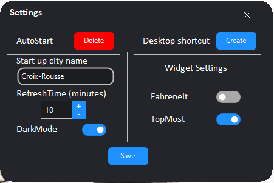
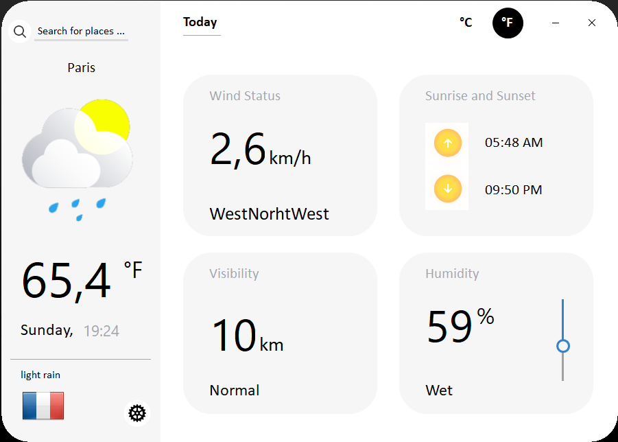
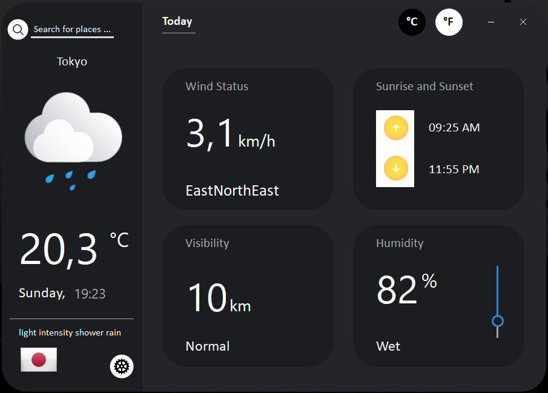

# TinyWeather

## Introduction

TinyWeather est une application qui récupère les données d'une API au format JSON et qui les mets en forme sur une application client lourds.

Le but recherché à travers ce projet était, de m'exercer à récupérer les données d'une API.

Vous pouvez télécharger le projet et le compilé ou récupérer le fichier TinyWeather.exe (situé dans le dossier : bin/Debug/).

## Sources
Les sources des documents utilisés :

- [Idée du design du front](https://dribbble.com/shots/10460680-Weather-App)

- [Vidéo tutorial pour interroger une API](https://www.youtube.com/watch?v=aWePkE2ReGw)

- [API pour récupérer les informations météorologique](https://openweathermap.org/api)

- [Banque d'image pour les drapeau](https://www.countryflags.io/)

- [Icons en fonctions du temps (nuage, soleil, pluie, etc...)](https://dribbble.com/shots/5981134-17-Free-Weather-Icons)

- [Icon de la loupe pour la barre de recherche](https://icones8.fr/)

- [Framework pour le front (GunaUI)](https://github.com/sobatdata/Guna.UI-Framework-Lib)

## Installer & utiliser 

Télécharger le lien ci dessous :

TinyWeather release : <a href="https://github.com/PierroD/TinyWeather/raw/master/TinyWeather/bin/Release/TinyWeather.zip">Download link</a>

Extraire l'archive (ne pas supprimer les .dll ils sont importants pour le bon fonctionnement de l'appliation).

Pour sélectionner une ville par défaut au démarrage de l'application, il suffit de cliquer sur l'icon en forme d'écrou.

Une fenêtre va vous permettre de changer la ville par défaut ou de passer en mode sombre ("DarkMode").

## Rendu final

### Paris

### Tokyo

### Settings 

